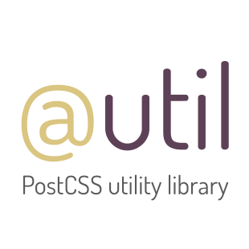

# PostCSS Utility Library [![Build Status][ci-img]][ci]

[PostCSS] plugin a collection of mixins, shortcuts, helpers and tools for your CSS.

<p align="center">
    <a href="http://ismamz.github.io/postcss-utilities">
        
    </a>
</p>

[PostCSS]: https://github.com/postcss/postcss
[ci-img]:  https://travis-ci.org/ismamz/postcss-utilities.svg
[ci]:      https://travis-ci.org/ismamz/postcss-utilities

[postcss-utilities](http://github.io/ismamz/postcss-utilities) is a [PostCSS] plugin that have the most used mixins, shortcuts and helpers to use as native `@util` rules in yours stylesheets.


### What is the difference with preprocessor’s mixins libraries?

- You don’t need extra files for mixins.
- You don’t need mixins for vendor prefixes (use [autoprefixer plugin](https://github.com/postcss/autoprefixer) for that)
- You can use LESS, SASS, pure CSS or whatever you want.

### [See Documentation](http://ismamz.github.io/postcss-utilities)

## Example

### Input
```css
.truncate {
    @util truncate;
    width: 500px;
}

.cfx {
    @util clearfix;
}

.box-16-9 {
    background-color: #ccc;
    margin-bottom: 20px;
    @util aspect-ratio(16:9);
}

.circle {
    @util circle(200px, red);
}
```

### Output
```css
.truncate {
    width: 500px;
    white-space: nowrap;
    overflow: hidden;
    text-overflow: ellipsis;
}

.cfx:after {
    content: '';
    display: block;
    clear: both;
}

.box-16-9 {
    background-color: #ccc;
    margin-bottom: 20px;
    position: relative;
    display: block;
    height: 0;
    padding: 0;
    overflow: hidden;
    padding-bottom: 56.25%;
}

.circle {
    border-radius: 50%;
    width: 200px;
    height: 200px;
    background-color: red;
}
```

## Usage

```js
postcss([ require('postcss-utilities') ])
```

See [PostCSS] docs for examples for your environment.

## Contributors

- [Andrey Sitnik](https://github.com/ai)
- [Marcus Tisäter](https://github.com/marcustisater)
